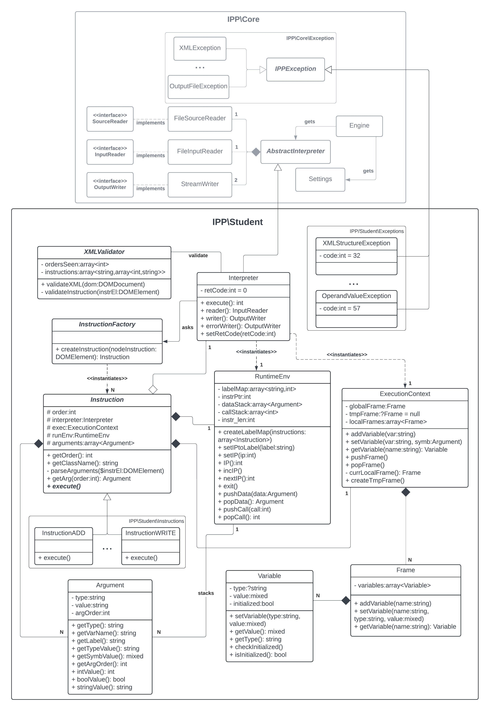

## Implementační dokumentace k 2. úloze do IPP 2023/2024
Jméno a příjmení: Adam Valík  
Login: xvalik05 

_Rámec IPP\Core byl poskytnut, a tudíž neimplementován autorem. Veškerá autorská implementace se nachází v IPP\Student._

### IPP\Core
Program začíná v rámci IPP\Core, který slouží jako podklad pro studentskou implementaci. Třída ``Engine`` obstarává vstupní argumenty příkazové řádky a bezpečně instanciuje objekt třídy ``IPP\Student\Interpreter`` společně s jejím přístupem ke vstupně-výstupním metodám.

### IPP\Student\Interpreter
Třída ``Interpreter`` dědí atributy a metody třídy ``IPP\Core\AbstractInterpreter`` a její metoda ``execute()`` slouží jako vstupní bod k implementaci projektu. 

Nejdříve dojde ke kompletní validaci zdrojového XML souboru abstraktní třídou ``XMLValidator`` která slouží jako modul zahrnující činnosti vedoucí k odchycení chyb v XML kódu ze sémantického hlediska dle očekávané struktury a taktéž dle očekávaných parametrů jednotlivých instrukcí. Pakliže není hozena žádná výjimka, následná interpretace může očekávat správný formát a stukturu zpracovávaného kódu a předejít tak chybám a dalším redundantním kontrolám.

Po validaci je přistoupeno k instanciaci tříd ``ExecutionContext`` a ``RuntimeEnv``, které slouží k běhu interpretace (popsáno níže) a pro každý jednotlivý ``<instruction>`` element je vytvořen objekt instrukce, seskupen do seznamu instrukcí.

O vytváření objektů konkrétních instrukcí se stará abstraktní třída ``InstructionFactory``, jež následuje návrhový vzor Tovární metody, který se pro tento účel nabízel jako vhodný, jelikož umožňuje zapouzdření vytváření instancí konkrétních instrukcí. Její statická metoda ``createInstruction()`` pak z DOM uzlu instrukce získá operační kód, na základě kterého vrací nově vytvořený objekt příslušné instrukce (``InstructionADD``, ...,  ``InstructionWRITE`` ze jmenného prostoru ``IPP\Student\Instructions``), které taktéž předává odkazy na objekty ``Interpreter``, ``ExecutionContext``, ``RuntimeEnv`` pro pozdější práci s interpretací.

Seznam instrukcí je následně seřazen a dochází k postupné interpretaci jednotlivých instrukcí.

### IPP\Student\RuntimeEnv
Třída ``RuntimeEnv`` pracuje s informacemi potřebnými pro běhové prostředí. Před začátkem vykonávání instrukcí je volána její metoda ``createLabelMap()``, která vytváří asociativní pole, kde mapuje jednotlivá návěští ``InstructionLABEL`` na jejich příslušné indexy pro následující korektní řízení toku programu. Ten je obstaráván indexem do pole instrukcí, jakožto ukazatelem na vykonávanou instrukci a třída ``RuntimeEnv`` obsahuje sadu metod pro manipulaci s ním, např. v případě skoku. Dále tato třída zahrnuje dva zásobníky, datový zásobník pro práci s intrukcemi ``PUSHS`` a ``POPS`` a zásobník volání pro instrukce ``CALL`` a ``RETURN``.

### IPP\Student\ExecutionContext
Práce s paměťovými rámci je vykonávána přes metody třídy ``ExecutionContext``. Tato třída zachycuje aktuální stav při práci s pamětí, vytváření a editaci paměťových rámců, ale především korektní přístup k proměnným, který probíhá výhradně přes tuto třídu. Každý paměťový rámec (globální, dočasný, lokální) je reprezentován třídou ``Frame`` a slouží především k uchování proměnných, jež se v něm nacházejí. Při tvorbě nebo přístupu k proměnné pak kontroluje, zdali proměnná již existuje, a případně tvoří/nastavuje/vrací proměnnou reprezentovanou třídou ``Variable``, která si uchovává především její typ a hodnotu.

### IPP\Student\Instructions
Bázová abstraktní třída ``Instruction`` slouží jako ucelení společných atributů pro všechny instrukce, kterými je především seznam argumentů. Ty jsou reprezentovány třídou ``Argument`` a drží data převzatá z poduzlů (``arg1``, ``arg2`` a ``arg3``) instrukce společně s metodami na konvertování získaných hodnot na jednotlivé typy. Třida ``Instruction`` však především definuje abstraktní metodu ``execute()``, kterou každá z jednotlivých instrukcí ve jmenném prostoru ``IPP\Student\Instructions`` implementuje.

Interpretace instrukcí se pak provádí za použití poskytnutých metod objektů ``Interpreter``, ``RuntimeEnv`` a ``ExecutionContext``, které většinu potřebné implementace zahrnují, nejčastější řešení pak rozeznává proměnné a literály v neterminálu ``<symb>`` a podle toho získává a ukládá patřičné hodnoty.

### IPP\Student\Exceptions
Volání metody ``execute()`` ve třídě ``Engine`` zachycuje a zpracovává výjimky třidy ``IPP\Core\IPPException``. Tato třída byla zděděna 9 podtřídami ve jmeném prostoru ``IPP\Student\Exceptions``, které jsou definovány svým chybovým kódem a patřičně házeny, pakliže dojde k chybě v běhu programu.

## UML Diagram Tříd
   
Abstraktní třídy a metody jsou vyznačeny zvýrazněnou kurzívou. Rámec IPP\Core, jež byl poskytnut, je uveden ve zkrácené formě a šedou barvou. Pro přehlednost diagramu jsou vynechány vztahy mezi výjimkami a zbylými třídami a výčty jednotlivých instrukcí a výjimek jsou označeny ``...``. V diagramu se též pro přehled komunikace mezi rámci nachází označení jednotlivých jmenných prostorů.

### PHPStan
Při implementaci projektu byl použit nástroj PHPStan pro statickou analýzu kódu. Kód programu vyhovuje analýze nástroje PHPStan na úrovni 9.

### Odkazy
1. Well-Formed XML Document [online]. Dostupné z: https://www.w3.org/TR/xml/#sec-well-formed
2. PHP manual [online]. Dostupné z: https://php.net